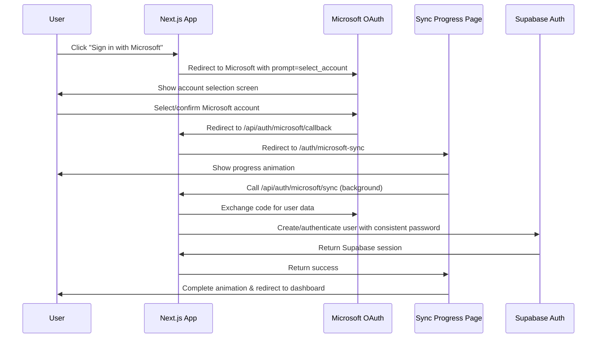

# Custom Microsoft OAuth Setup Guide

This guide walks you through implementing **custom Microsoft OAuth authentication** that integrates with Supabase Auth, avoiding the $600/month Teams plan requirement while maintaining full functionality.

## 🎯 Overview

This implementation uses **direct Microsoft OAuth** with your Next.js application and then authenticates users with Supabase using standard email/password auth. This approach gives you:

- ✅ **Free Microsoft OAuth** - No Supabase Teams plan required
- ✅ **Full Supabase Integration** - Users still get Supabase sessions, RLS, etc.
- ✅ **School-friendly** - Perfect for educational institutions using Microsoft accounts
- ✅ **Custom Control** - You manage the OAuth flow directly

## 📋 Prerequisites

- Access to your school's Microsoft 365 Admin Center or Azure AD admin portal
- Admin access to your Supabase project
- Your application's domain/URL (production) or localhost (development)

## Part 1: Microsoft Azure AD App Registration

### Step 1: Create an App Registration

1. **Navigate to Azure Portal**
   - Go to [Azure Portal](https://portal.azure.com)
   - Sign in with your admin Microsoft account

2. **Access Azure Active Directory**
   - Search for "Azure Active Directory" in the search bar
   - Click on "Azure Active Directory" in the results

3. **Create App Registration**
   - In the left sidebar, click "App registrations"
   - Click "New registration" at the top
   - Fill in the registration form:
     - **Name**: "Blueprint Student Portal" (or your preferred app name)
     - **Supported account types**: 
       - For school-only access: "Accounts in this organizational directory only"
       - For multi-tenant: "Accounts in any organizational directory"
     - **Redirect URI**: 
       - Platform: Web
       - Development: `http://localhost:3000/api/auth/microsoft/callback`
       - Production: `https://yourdomain.com/api/auth/microsoft/callback`

4. **Register the Application**
   - Click "Register"
   - **📝 Note down the Application (client) ID** from the Overview page

### Step 2: Configure Authentication

1. **Add Additional Redirect URIs** (if needed)
   - In your app registration, go to "Authentication" in the left sidebar
   - Under "Redirect URIs", click "Add URI"
   - Add both development and production URIs:
     - Development: `http://localhost:3000/api/auth/microsoft/callback`
     - Production: `https://yourdomain.com/api/auth/microsoft/callback`

2. **Configure Token Settings**
   - Still in "Authentication"
   - Under "Implicit grant and hybrid flows":
     - ✅ Check "Access tokens"
     - ✅ Check "ID tokens"

### Step 3: Create Client Secret

1. **Generate Secret**
   - Go to "Certificates & secrets" in the left sidebar
   - Click "New client secret"
   - Add description: "Custom OAuth Implementation"
   - Choose expiration (24 months recommended)
   - Click "Add"

2. **Copy the Secret**
   - ⚠️ **CRITICAL**: Copy the secret value immediately - you cannot view it again
   - **📝 Note down the Client Secret Value**

### Step 4: Configure API Permissions

1. **Add Required Permissions**
   - Go to "API permissions" in the left sidebar
   - Click "Add a permission"
   - Select "Microsoft Graph" → "Delegated permissions"
   - Add these permissions:
     - `openid` (should be there by default)
     - `profile` (should be there by default)
     - `email` (should be there by default)
     - `User.Read` (to get user profile information)

2. **Grant Admin Consent** (recommended)
   - Click "Grant admin consent for [Organization]"
   - This allows all users in your organization to use this app without individual consent

### Step 5: Note Configuration Details

Copy these values for your environment configuration:
- **Application (client) ID**: Found on the "Overview" page
- **Client Secret**: The value you copied in Step 3
- **Directory (tenant) ID**: Found on the "Overview" page
  - Use specific tenant ID to restrict to your organization only
  - Use `common` for multi-tenant (any Microsoft account)

## Part 2: Application Configuration

### Step 1: Update Environment Variables

Create or update your `.env.local` file with the Microsoft OAuth configuration:

```bash
# Microsoft OAuth Configuration
AZURE_AD_CLIENT_ID=your-application-client-id-from-azure
AZURE_AD_CLIENT_SECRET=your-client-secret-from-azure
AZURE_AD_TENANT_ID=your-tenant-id-or-common

# Site Configuration  
NEXT_PUBLIC_SITE_URL=http://localhost:3000

# Existing Supabase Configuration (no changes needed)
NEXT_PUBLIC_SUPABASE_URL=your-supabase-url
NEXT_PUBLIC_SUPABASE_ANON_KEY=your-supabase-anon-key
SUPABASE_SERVICE_ROLE_KEY=your-service-role-key
```

### Step 2: Environment Variables Explanation

- **AZURE_AD_CLIENT_ID**: The Application (client) ID from your Azure app registration
- **AZURE_AD_CLIENT_SECRET**: The client secret you generated and copied
- **AZURE_AD_TENANT_ID**: 
  - Use your specific tenant ID to restrict to your school only
  - Use `common` to allow any Microsoft account (personal + organizational)
- **NEXT_PUBLIC_SITE_URL**: Your application's URL (update for production)

## Part 3: How the Implementation Works

### Authentication Flow



### Key Implementation Details

1. **Enhanced UX Flow**: Improved user experience with:
   - **Account Selection**: `prompt=select_account` forces Microsoft to show account picker
   - **Progress Feedback**: Visual progress screen during sync process
   - **Background Processing**: Actual authentication happens behind progress animation

2. **Custom OAuth Routes**: We created three API routes:
   - `/api/auth/microsoft` - Initiates OAuth flow with account selection
   - `/api/auth/microsoft/callback` - Handles callback and redirects to progress page
   - `/api/auth/microsoft/sync` - Performs actual authentication and user creation

3. **Progress Screen**: `/auth/microsoft-sync` page provides:
   - Animated progress indicators
   - Professional branding with Microsoft colors
   - Error handling and retry functionality
   - Smooth transition to onboarding/dashboard

4. **Supabase Integration**: After Microsoft authentication:
   - Generate consistent password based on Microsoft user ID
   - Create or sign in user with Supabase using email/password auth
   - User gets full Supabase session with all features

5. **State Management**: Secure state validation and redirect handling

6. **User Data**: Microsoft profile information is stored in Supabase user metadata

## Part 4: Testing the Integration

### Step 1: Development Testing

1. **Start your development server**
   ```bash
   cd apps/web
   pnpm dev
   ```

2. **Test Microsoft Login**
   - Navigate to your login page (`http://localhost:3000/login`)
   - Click "Sign in with Microsoft"
   - You should be redirected to Microsoft's login page
   - After successful login, you should be redirected back to your app

### Step 2: Verify Integration

After successful login, verify:

1. **Supabase Auth Dashboard**
   - Check that user appears in Authentication → Users
   - Verify user metadata includes Microsoft profile data

2. **Application Flow**
   - New users should go through onboarding flow (`/role-selection`)
   - Existing users should be redirected based on role
   - User session should persist across page refreshes

3. **User Data Access**
   - User should have access to Supabase tables (based on RLS policies)
   - Auth state should work with your existing AuthProvider

## Part 5: Production Deployment

### Step 1: Update Environment Variables

For production deployment:

```bash
# Update these for production
AZURE_AD_CLIENT_ID=same-as-development
AZURE_AD_CLIENT_SECRET=same-as-development  
AZURE_AD_TENANT_ID=same-as-development
NEXT_PUBLIC_SITE_URL=https://yourdomain.com

# Production Supabase values
NEXT_PUBLIC_SUPABASE_URL=your-production-supabase-url
NEXT_PUBLIC_SUPABASE_ANON_KEY=your-production-supabase-anon-key
```

### Step 2: Update Azure Redirect URIs

In your Azure app registration:
1. Go to "Authentication"
2. Add production redirect URI: `https://yourdomain.com/api/auth/microsoft/callback`
3. Keep development URI for local testing

### Step 3: Test Production Flow

- Test complete authentication flow in production
- Verify redirects work correctly  
- Test both new user onboarding and existing user login

## Part 6: Troubleshooting

### Common Issues

1. **"AADSTS50011: Reply URL mismatch"**
   ```
   Solution: Verify redirect URI in Azure exactly matches:
   - Dev: http://localhost:3000/api/auth/microsoft/callback
   - Prod: https://yourdomain.com/api/auth/microsoft/callback
   ```

2. **"Invalid client secret"**
   ```
   Solution: 
   - Check AZURE_AD_CLIENT_SECRET in .env.local
   - Regenerate secret in Azure if expired
   - Ensure no extra spaces/characters in secret
   ```

3. **User not created in Supabase**
   ```
   Solution:
   - Check Supabase logs for signup errors
   - Verify email is extracted from Microsoft response
   - Check RLS policies aren't blocking user creation
   ```

4. **Redirect not working after auth**
   ```
   Solution:
   - Verify NEXT_PUBLIC_SITE_URL is correct
   - Check browser network tab for redirect chains
   - Ensure cookies are being set properly
   ```

### Debug Steps

1. **Check Application Logs**
   ```bash
   # Check server logs during OAuth flow
   pnpm dev
   # Watch for console.log statements in callback route
   ```

2. **Verify Environment Variables**
   ```bash
   # In your app, temporarily log env vars (remove after debugging)
   console.log('Azure Client ID:', process.env.AZURE_AD_CLIENT_ID)
   ```

3. **Test API Routes Directly**
   ```bash
   # Test OAuth initiation
   curl http://localhost:3000/api/auth/microsoft
   ```

### Browser Network Inspection

Monitor these requests during OAuth flow:
1. `GET /api/auth/microsoft` → Should redirect to Microsoft
2. Microsoft login → User enters credentials  
3. `GET /api/auth/microsoft/callback?code=...` → Should redirect to your app
4. Final redirect to dashboard/onboarding

## Part 7: Security Considerations

### Production Security

1. **Environment Variables**
   - Never commit secrets to version control
   - Use secure environment variable management in production
   - Rotate client secrets regularly (every 12-24 months)

2. **Tenant Restriction**
   - Use specific tenant ID instead of `common` for school-only access
   - Consider additional email domain validation

3. **State Validation**
   - Implementation includes secure state parameter validation
   - Prevents CSRF attacks

4. **Cookie Security**
   - OAuth state cookies are httpOnly and secure in production
   - Short expiration times (10 minutes)

### Monitoring

1. **Authentication Logs**
   - Monitor Supabase auth logs for unusual activity
   - Set up alerts for failed authentication attempts

2. **Application Logs**
   - Log OAuth errors for debugging
   - Monitor for credential issues

## 📊 Configuration Summary

After completing setup, you should have:

### ✅ Azure Configuration
- Azure AD App Registration with correct redirect URIs
- Client ID and Secret configured  
- Proper API permissions granted
- Admin consent granted (if applicable)

### ✅ Application Configuration
- Environment variables properly set
- Custom OAuth routes implemented  
- Microsoft login button integrated
- Supabase authentication working

### ✅ User Experience
- Microsoft login prominently displayed
- Seamless authentication flow
- Proper onboarding for new users
- Role-based redirects for existing users
- Full Supabase functionality maintained

## 🎉 Benefits Achieved

- **💰 Cost Savings**: $0/month vs $600/month Supabase Teams plan
- **🏫 School-Friendly**: Perfect for educational Microsoft environments  
- **🔧 Full Control**: You own the OAuth implementation
- **⚡ Performance**: Direct OAuth flow with minimal redirects
- **🔒 Security**: Industry-standard OAuth 2.0 implementation
- **📱 Compatibility**: Works with your existing auth system

Your users can now sign in using their Microsoft/Office 365 accounts with full Supabase integration at no additional cost!
